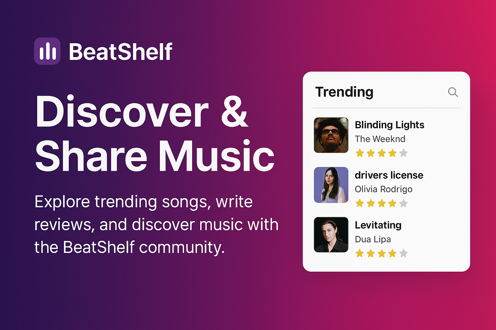

<div align="center">


# BeatShelf

### *Where music meets community.*

**Discover tracks. Write reviews. Share your taste. Built for people who take music seriously.**

<br />

[](https://beatshelf.netlify.app/)
[](./LICENSE)
[](https://github.com/akshitsutharr/beatshelf/stargazers)
[](https://github.com/akshitsutharr/beatshelf/network/members)
[](https://github.com/akshitsutharr/beatshelf/issues)

<br />


</div>

---

## 📋 Table of Contents

- [✨ What is BeatShelf?](#-what-is-beatshelf)
- [🔥 Features](#-features)
- [🖼️ Preview](#️-preview)
- [🧱 Tech Stack](#-tech-stack)
- [📁 Project Structure](#-project-structure)
- [🏗️ Architecture](#️-architecture)
- [🗄️ Database Schema](#️-database-schema)
- [🚀 Getting Started](#-getting-started)
  - [Prerequisites](#prerequisites)
  - [Installation](#installation)
  - [Environment Variables](#environment-variables)
  - [Running the Dev Server](#running-the-dev-server)
- [🔐 Authentication Setup (Clerk)](#-authentication-setup-clerk)
- [🎵 Spotify API Setup](#-spotify-api-setup)
- [🗃️ Supabase Setup](#️-supabase-setup)
- [📡 API Routes](#-api-routes)
- [📖 Usage Guide](#-usage-guide)
- [🧪 Scripts](#-scripts)
- [🌍 Deployment](#-deployment)
- [🛣️ Roadmap](#️-roadmap)
- [🤝 Contributing](#-contributing)
- [📄 License](#-license)
- [🙏 Acknowledgements](#-acknowledgements)

---

## ✨ What is BeatShelf?

**BeatShelf** is a full-stack **music discovery & community review platform** — the "Letterboxd for music." It's built for listeners who want to do more than just stream: they want to *document* their taste, *discover* hidden gems, and *connect* with a community that cares about music as much as they do.

Powered by the **Spotify Web API** for rich music data, **Supabase** for a real-time PostgreSQL backend, and **Clerk** for seamless authentication, BeatShelf delivers a premium listening journal experience in a blazing-fast Next.js 16 App Router shell.

**Core value props:**
- 🎧 Search any track, album, or artist from Spotify's entire catalog
- ✍️ Write rich-text reviews with a star rating system (1.0–5.0)
- 🎨 Generate shareable review cards in multiple beautiful themes
- 📊 Track your music listening habits via a personal dashboard
- 👥 Browse a live community feed of reviews and ratings from all users
- ❤️ Save favorites and build your personal music library
- 🔥 Explore trending charts and brand-new releases

> **Live:** [https://beatshelf.netlify.app/](https://beatshelf.netlify.app/)

---

## 🔥 Features

### 🏠 Home — Living Music Wall
An animated, cinematic home page featuring a scrolling "Living Music Wall" built with Framer Motion. Showcases featured tracks, new releases, trending songs, and the latest community reviews — all in one immersive landing experience.

### 🔍 Search & Discovery
- Full-text search across **tracks**, **albums**, and **artists** via the Spotify API
- Multi-type results with cover art, metadata, and direct links
- `/explore` page for curated browsing
- Genre filters, charts, and featured playlists via dedicated API endpoints

### 🔥 Trending
- Dedicated `/trending` page with weekly/daily filter tabs
- Tracks ranked by community activity (review & rating counts) from Supabase, merged with Spotify's new-release data
- Animated card transitions with Framer Motion

### 🎵 Song Detail Pages (`/song/[id]`)
- Full track metadata pulled from Spotify (album art, artist, duration, release date)
- 30-second audio preview player
- Star rating widget (1.0–5.0 in 0.5 increments)
- Rich-text review composer with formatting support
- All community reviews for that track displayed below
- One-click Add to Favorites

### 💿 Album Pages (`/album/[id]`)
- Full album tracklist with playable 30s previews
- Album-level review and rating system
- Download & share review card

### 🎤 Artist Pages (`/artist/[id]`)
- Artist bio, followers, genres, and popularity score
- Top tracks grid
- Full discography (albums & singles) with deduplication

### 🎨 Review Card Generator
A fully client-side card generator (`html-to-image`) that lets users create beautiful, shareable images of their reviews. Ships with **multiple themes**:
- 🖤 **Obsidian** — sleek dark minimal
- 🌌 **Aurora** — deep green cosmic
- *(and more)*

Cards include album art, rating stars, review excerpt, username, and date. Export as PNG.

### 📊 Personal Dashboard (`/dashboard`)
- Stats grid: total reviews, ratings, favorites, and more
- Quick-review shortcut
- Personal activity history

### ❤️ Favorites (`/favorites`)
- Save any track as a favorite with a single click
- Persistent across sessions via Supabase
- Organized personal library view

### 👥 Community Feed (`/community`)
- Real-time activity feed of recent reviews and ratings from all users
- Tabbed view: All Activity / Reviews / Ratings
- Top Contributors leaderboard (ranked by total contributions)
- Community stats panel

### 👤 User Profiles (`/profile/[username]`)
- Public profile page showing a user's reviews and ratings
- Avatar, username, bio from Clerk/Supabase

### ⚙️ Settings (`/settings`)
- Profile editing (username, bio, avatar)
- Notification preferences toggle
- Privacy controls
- Data export option

### ✍️ Write Review Page (`/write-review`)
- Dedicated full-page review composer
- Search for a song, write your review, rate it, and publish

---

## 🖼️ Preview

> 📸 The preview image below is the live OG image. Place your own screenshots under `public/screenshots/` and update the paths to make this section shine.

| Home — Living Music Wall | Trending Page |
|:---:|:---:|
|  | *Add screenshot: `public/screenshots/trending.png`* |

| Song Detail & Review | Review Card Generator |
|:---:|:---:|
| *Add screenshot: `public/screenshots/song.png`* | *Add screenshot: `public/screenshots/card-gen.png`* |

| Community Feed | Personal Dashboard |
|:---:|:---:|
| *Add screenshot: `public/screenshots/community.png`* | *Add screenshot: `public/screenshots/dashboard.png`* |

> **Tip:** Record a short screen capture and save it as `public/screenshots/demo.gif` for maximum impact.

---

## 🧱 Tech Stack

| Layer | Technology | Purpose |
|---|---|---|
| **Framework** | [Next.js 16](https://nextjs.org/) (App Router) | Full-stack React framework |
| **UI Library** | [React 19](https://react.dev/) | Component model |
| **Language** | [TypeScript 5](https://www.typescriptlang.org/) | Type safety |
| **Styling** | [Tailwind CSS 3](https://tailwindcss.com/) + `tailwindcss-animate` | Utility-first CSS |
| **Components** | [Radix UI](https://www.radix-ui.com/) + shadcn/ui patterns | Accessible, headless primitives |
| **Animation** | [Framer Motion 12](https://www.framer.com/motion/) | Page & element animations |
| **Icons** | [Lucide React](https://lucide.dev/) | Icon library |
| **Auth** | [Clerk](https://clerk.com/) (`@clerk/nextjs`) | Authentication & user management |
| **Database** | [Supabase](https://supabase.com/) (PostgreSQL) | Backend, RLS, realtime |
| **Music Data** | [Spotify Web API](https://developer.spotify.com/) | Tracks, albums, artists |
| **Charts** | [Recharts](https://recharts.org/) | Data visualizations |
| **Image Export** | [html-to-image](https://github.com/bubkoo/html-to-image) | Review card PNG generation |
| **Forms** | [React Hook Form](https://react-hook-form.com/) + [Zod](https://zod.dev/) | Form handling & validation |
| **Toasts** | [Sonner](https://sonner.emilkowal.ski/) | Notifications |
| **Fonts** | [Geist](https://vercel.com/font) + Inter | Typography |
| **SEO** | [next-sitemap](https://github.com/iamvishnusankar/next-sitemap) | Sitemap generation |
| **Deployment** | [Netlify](https://netlify.com/) | Hosting |

---

## 📁 Project Structure

```
beatshelf/
├── app/                          # Next.js App Router
│   ├── layout.tsx                # Root layout (ClerkProvider, AuthProvider, Navbar)
│   ├── page.tsx                  # Home page (Living Music Wall, hero, featured)
│   ├── globals.css               # Global styles + CSS variables
│   │
│   ├── album/[id]/               # Album detail page
│   ├── albums/                   # Album browser
│   ├── artist/[id]/              # Artist profile page
│   ├── artists/                  # Artist browser
│   ├── community/                # Community activity feed
│   ├── dashboard/                # Personal stats dashboard
│   ├── debug/                    # Debug / diagnostics page
│   ├── explore/                  # Browse & discovery
│   ├── favorites/                # Saved favorites
│   ├── profile/[username]/       # Public user profile
│   ├── reviews/                  # All reviews feed
│   ├── search/                   # Search results
│   ├── settings/                 # User settings
│   ├── sign-in/                  # Clerk sign-in
│   ├── sign-up/                  # Clerk sign-up
│   ├── song/[id]/                # Song detail + review page
│   ├── trending/                 # Trending charts
│   ├── write-review/             # Review composer
│   │
│   └── api/                      # API Route Handlers
│       ├── auth/sync-profile/    # Sync Clerk → Supabase profile
│       ├── reviews/              # POST review (+ /like sub-route)
│       └── spotify/              # Spotify proxy routes
│           ├── album/            # Album data
│           ├── artist/           # Single artist
│           ├── artists/          # Artist list
│           ├── charts/           # Charts
│           ├── featured/         # Featured content
│           ├── genres/           # Genre list
│           ├── genres-data/      # Genre metadata
│           ├── playlists/        # Playlists
│           ├── random-songs/     # Random track picker
│           ├── search/           # Search proxy
│           ├── token/            # Access token endpoint
│           ├── track/            # Single track
│           └── trending/         # Trending tracks
│
├── components/                   # Shared React components
│   ├── ui/                       # shadcn/ui primitives
│   │   ├── rich-text-editor.tsx  # Formatted review input
│   │   ├── star-rating.tsx       # Interactive star rating
│   │   └── ...                   # (accordion, button, card, dialog, …)
│   ├── navbar.tsx                # Top navigation bar
│   ├── living-music-wall.tsx     # Animated scrolling home wall
│   ├── review-card-generator.tsx # PNG review card with theme picker
│   ├── song-card.tsx             # Reusable song card
│   ├── user-panel.tsx            # Slide-out user panel
│   ├── debug-spotify.tsx         # Spotify API debug panel
│   └── theme-provider.tsx        # next-themes wrapper
│
├── contexts/
│   └── auth-context.tsx          # Clerk ↔ Supabase auth bridge
│
├── hooks/
│   ├── use-toast.ts              # Toast hook
│   └── use-mobile.tsx            # Mobile breakpoint hook
│
├── lib/
│   ├── spotify.ts                # Spotify API client (token, search, tracks…)
│   ├── supabase.ts               # Supabase client + TypeScript DB types
│   ├── supabase-admin.ts         # Server-side admin client
│   ├── db-id.ts                  # Clerk ID → database UUID mapping
│   └── utils.ts                  # Shared utilities (cn, etc.)
│
├── sql/
│   └── scripts/
│       └── 02-create-policies.sql # Supabase RLS policies
│
├── public/                       # Static assets
│   ├── bslogo.png                # BeatShelf logo
│   ├── icon1.png                 # App icon
│   ├── preview.png               # OG preview image
│   └── ...
│
├── styles/                       # Additional global styles
├── scripts/                      # Utility scripts
├── next.config.mjs               # Next.js config
├── tailwind.config.ts            # Tailwind config
├── tsconfig.json                 # TypeScript config
└── package.json
```

---

## 🏗️ Architecture

BeatShelf follows a **hybrid rendering** model using Next.js App Router — Server Components for data-fetching layouts and Client Components for interactive UI elements.

```mermaid
graph TD
    subgraph Browser
        UI[React Client Components]
        Auth[Clerk Auth SDK]
    end

    subgraph "Next.js App Router (Server)"
        Pages[Page / Layout RSC]
        APIRoutes[/api/* Route Handlers]
    end

    subgraph "External Services"
        Spotify[Spotify Web API]
        SupabaseDB[(Supabase PostgreSQL)]
        ClerkAPI[Clerk Auth API]
    end

    UI -- "User interactions" --> Pages
    UI -- "Auth state" --> Auth
    Auth -- "JWT / session" --> ClerkAPI
    Pages -- "Server-side fetch" --> APIRoutes
    APIRoutes -- "Client credentials OAuth2" --> Spotify
    APIRoutes -- "Admin client (service role)" --> SupabaseDB
    UI -- "Anon / user queries" --> SupabaseDB
    ClerkAPI -- "Sync webhook / API call" --> APIRoutes
```

**Data Flow:**
1. **Auth**: Clerk handles sign-up/sign-in. On first login, `/api/auth/sync-profile` upserts a matching row into Supabase `profiles`.
2. **Music Data**: All Spotify calls go through `/api/spotify/*` server routes that hold the Client Credentials token securely. Tokens are cached server-side.
3. **User Data**: Reviews, ratings, and favorites are written via `/api/reviews` (server-side, uses Supabase service role). Reads use the public anon client directly from the browser.
4. **Review Cards**: Generated entirely client-side with `html-to-image` — no server round-trip.

---

## 🗄️ Database Schema

BeatShelf uses Supabase (PostgreSQL) with Row Level Security enabled.

### `profiles`
| Column | Type | Notes |
|---|---|---|
| `id` | `uuid` | Maps to hashed Clerk user ID |
| `username` | `text` | Unique display name |
| `full_name` | `text?` | Optional full name |
| `avatar_url` | `text?` | Clerk profile image URL |
| `bio` | `text?` | User bio |
| `created_at` | `timestamptz` | Auto-set |
| `updated_at` | `timestamptz` | Auto-updated |

### `songs`
| Column | Type | Notes |
|---|---|---|
| `id` | `text` | Spotify track ID (primary key) |
| `name` | `text` | Track title |
| `artist_name` | `text` | Joined artist names |
| `album_name` | `text` | Album name |
| `album_image_url` | `text?` | Cover art URL |
| `preview_url` | `text?` | 30-second preview URL |
| `duration_ms` | `int?` | Track duration |
| `release_date` | `date?` | Album release date |
| `spotify_url` | `text?` | External Spotify link |
| `created_at` | `timestamptz` | Auto-set |
| `updated_at` | `timestamptz` | Auto-updated |

### `reviews`
| Column | Type | Notes |
|---|---|---|
| `id` | `uuid` | Primary key |
| `user_id` | `uuid` | FK → `profiles.id` |
| `song_id` | `text` | FK → `songs.id` |
| `content` | `text` | Rich-text review body |
| `created_at` | `timestamptz` | Auto-set |
| `updated_at` | `timestamptz` | Auto-updated |

> **Constraint:** Unique on `(user_id, song_id)` — one review per user per song.

### `ratings`
| Column | Type | Notes |
|---|---|---|
| `id` | `uuid` | Primary key |
| `user_id` | `uuid` | FK → `profiles.id` |
| `song_id` | `text` | FK → `songs.id` |
| `rating` | `numeric` | 1.0–5.0 (enforced by CHECK constraint) |
| `created_at` | `timestamptz` | Auto-set |
| `updated_at` | `timestamptz` | Auto-updated |

### `favorites`
| Column | Type | Notes |
|---|---|---|
| `id` | `uuid` | Primary key |
| `user_id` | `uuid` | FK → `profiles.id` |
| `song_id` | `text` | FK → `songs.id` |
| `created_at` | `timestamptz` | Auto-set |

### RLS Policies

Row Level Security is enabled. Policies are defined in `sql/scripts/02-create-policies.sql`:
- **Reviews**: Users can only update/delete their own reviews; all authenticated users can read & insert.
- **Ratings**: Per-user enforcement with rating range `CHECK (rating >= 1.0 AND rating <= 5.0)`.

---

## 🚀 Getting Started

### Prerequisites

- **Node.js** `>= 18` (LTS recommended)
- **npm** (bundled with Node.js)
- A [Spotify Developer](https://developer.spotify.com/dashboard) account
- A [Supabase](https://supabase.com/) project
- A [Clerk](https://clerk.com/) application

### Installation

```bash
# 1. Clone the repository
git clone https://github.com/akshitsutharr/beatshelf.git
cd beatshelf

# 2. Install dependencies
npm install

# 3. Create your local environment file
touch .env.local
```

### Environment Variables

Create a `.env.local` file in the project root and populate all values:

```env
# ─── Supabase ────────────────────────────────────────────────────────────────
NEXT_PUBLIC_SUPABASE_URL=https://your-project.supabase.co
NEXT_PUBLIC_SUPABASE_ANON_KEY=your_supabase_anon_key
SUPABASE_SERVICE_ROLE_KEY=your_supabase_service_role_key   # Server-side only

# ─── Spotify ─────────────────────────────────────────────────────────────────
SPOTIFY_CLIENT_ID=your_spotify_client_id
SPOTIFY_CLIENT_SECRET=your_spotify_client_secret

# ─── Clerk (Authentication) ──────────────────────────────────────────────────
NEXT_PUBLIC_CLERK_PUBLISHABLE_KEY=pk_live_...
CLERK_SECRET_KEY=sk_live_...

# Optional: Clerk redirect URLs (defaults usually work for localhost)
NEXT_PUBLIC_CLERK_SIGN_IN_URL=/sign-in
NEXT_PUBLIC_CLERK_SIGN_UP_URL=/sign-up
NEXT_PUBLIC_CLERK_AFTER_SIGN_IN_URL=/
NEXT_PUBLIC_CLERK_AFTER_SIGN_UP_URL=/
```

> ⚠️ Never commit `.env.local` to version control. It is already in `.gitignore`.

### Running the Dev Server

```bash
npm run dev
```

Open [http://localhost:3000](http://localhost:3000) — the app supports **Turbopack** for fast hot-module replacement.

---

## 🔐 Authentication Setup (Clerk)

BeatShelf uses **Clerk** for authentication. User sessions are managed by Clerk, and on each login, the user profile is synced to Supabase automatically.

**Setup steps:**

1. Go to [https://dashboard.clerk.com/](https://dashboard.clerk.com/) and create a new application.
2. Enable **Email/Password** sign-in (and any social providers you want).
3. Copy your **Publishable Key** and **Secret Key** into `.env.local`.
4. In the Clerk Dashboard → **Redirects**, set:
   - Sign-in URL: `/sign-in`
   - Sign-up URL: `/sign-up`
   - After sign-in/sign-up: `/`

**How it works internally:**

```
Clerk Sign-In → Clerk issues JWT
    → AuthContext detects new user
    → POST /api/auth/sync-profile
    → Supabase upserts profile row (id = hashed Clerk ID)
    → App loads profile from Supabase
```

The `clerkIdToDatabaseId()` utility in `lib/db-id.ts` deterministically maps the Clerk user ID to a stable UUID for use as the Supabase primary key.

---

## 🎵 Spotify API Setup

BeatShelf uses the **Spotify Web API** with the **Client Credentials** flow (no user login required). This means all music data (tracks, albums, artists) is fetched server-side using your app credentials.

**Setup steps:**

1. Go to [https://developer.spotify.com/dashboard](https://developer.spotify.com/dashboard) and log in.
2. Click **"Create App"**.
3. Fill in the app name (e.g. "BeatShelf Dev") and description.
4. Set the **Redirect URI** to `http://localhost:3000` (for local dev).
5. Accept the Terms of Service and click **Save**.
6. On the app settings page, copy the **Client ID** and **Client Secret**.
7. Add them to `.env.local`:
   ```env
   SPOTIFY_CLIENT_ID=your_client_id
   SPOTIFY_CLIENT_SECRET=your_client_secret
   ```

**Scopes used:** None — the Client Credentials flow doesn't require user scopes since BeatShelf only reads public Spotify catalog data.

**Token caching:** The server-side `getSpotifyToken()` in `lib/spotify.ts` caches the token in memory and automatically refreshes it 1 minute before expiry.

---

## 🗃️ Supabase Setup

### 1. Create a project

1. Go to [https://supabase.com/dashboard](https://supabase.com/dashboard) and create a new project.
2. Choose a region close to your users.
3. Save your **database password** somewhere safe.

### 2. Copy credentials

From **Project Settings → API**:
- Copy **Project URL** → `NEXT_PUBLIC_SUPABASE_URL`
- Copy **anon/public key** → `NEXT_PUBLIC_SUPABASE_ANON_KEY`
- Copy **service_role key** → `SUPABASE_SERVICE_ROLE_KEY`

### 3. Create the database schema

Open the **SQL Editor** in your Supabase dashboard and run the following:

```sql
-- Profiles table (synced from Clerk)
CREATE TABLE profiles (
  id UUID PRIMARY KEY,
  username TEXT UNIQUE NOT NULL,
  full_name TEXT,
  avatar_url TEXT,
  bio TEXT,
  created_at TIMESTAMPTZ DEFAULT NOW(),
  updated_at TIMESTAMPTZ DEFAULT NOW()
);

-- Songs cache (populated on first review/favorite)
CREATE TABLE songs (
  id TEXT PRIMARY KEY,           -- Spotify track ID
  name TEXT NOT NULL,
  artist_name TEXT NOT NULL,
  album_name TEXT NOT NULL,
  album_image_url TEXT,
  preview_url TEXT,
  duration_ms INTEGER,
  release_date DATE,
  spotify_url TEXT,
  created_at TIMESTAMPTZ DEFAULT NOW(),
  updated_at TIMESTAMPTZ DEFAULT NOW()
);

-- Reviews
CREATE TABLE reviews (
  id UUID PRIMARY KEY DEFAULT gen_random_uuid(),
  user_id UUID REFERENCES profiles(id) ON DELETE CASCADE,
  song_id TEXT REFERENCES songs(id) ON DELETE CASCADE,
  content TEXT NOT NULL,
  created_at TIMESTAMPTZ DEFAULT NOW(),
  updated_at TIMESTAMPTZ DEFAULT NOW(),
  UNIQUE(user_id, song_id)
);

-- Ratings
CREATE TABLE ratings (
  id UUID PRIMARY KEY DEFAULT gen_random_uuid(),
  user_id UUID REFERENCES profiles(id) ON DELETE CASCADE,
  song_id TEXT REFERENCES songs(id) ON DELETE CASCADE,
  rating NUMERIC CHECK (rating >= 1.0 AND rating <= 5.0) NOT NULL,
  created_at TIMESTAMPTZ DEFAULT NOW(),
  updated_at TIMESTAMPTZ DEFAULT NOW()
);

-- Favorites
CREATE TABLE favorites (
  id UUID PRIMARY KEY DEFAULT gen_random_uuid(),
  user_id UUID REFERENCES profiles(id) ON DELETE CASCADE,
  song_id TEXT REFERENCES songs(id) ON DELETE CASCADE,
  created_at TIMESTAMPTZ DEFAULT NOW()
);
```

### 4. Enable Row Level Security

```sql
ALTER TABLE profiles ENABLE ROW LEVEL SECURITY;
ALTER TABLE songs ENABLE ROW LEVEL SECURITY;
ALTER TABLE reviews ENABLE ROW LEVEL SECURITY;
ALTER TABLE ratings ENABLE ROW LEVEL SECURITY;
ALTER TABLE favorites ENABLE ROW LEVEL SECURITY;
```

Then apply the policies from `sql/scripts/02-create-policies.sql` via the SQL Editor.

### 5. Enable Realtime (optional)

In the Supabase dashboard → **Database → Replication**, enable replication for the `reviews` and `ratings` tables to power live community feeds.

---

## 📡 API Routes

All routes live under `app/api/`. Spotify routes act as a **secure server-side proxy** so credentials are never exposed to the browser.

| Route | Method | Description |
|---|---|---|
| `/api/auth/sync-profile` | `POST` | Upserts Clerk user into Supabase `profiles` |
| `/api/reviews` | `POST` | Creates/updates a review (+ optional rating) |
| `/api/reviews/like` | `POST` | Toggles a like on a review |
| `/api/spotify/search` | `GET` | Search tracks, albums, artists |
| `/api/spotify/track` | `GET` | Fetch single track metadata |
| `/api/spotify/album` | `GET` | Fetch album details + tracklist |
| `/api/spotify/artist` | `GET` | Fetch artist profile |
| `/api/spotify/artists` | `GET` | Fetch multiple artists by IDs |
| `/api/spotify/trending` | `GET` | Trending tracks |
| `/api/spotify/featured` | `GET` | Featured/curated content |
| `/api/spotify/charts` | `GET` | Music charts |
| `/api/spotify/genres` | `GET` | Genre list |
| `/api/spotify/genres-data` | `GET` | Genre metadata |
| `/api/spotify/playlists` | `GET` | Playlists |
| `/api/spotify/random-songs` | `GET` | Random track sampler |
| `/api/spotify/token` | `GET` | Current Spotify access token (debug) |

---

## 📖 Usage Guide

### As a new user

1. **Sign up** at `/sign-up` with your email and password.
2. Your profile is automatically created in Supabase on first login.
3. **Browse** the home page's Living Music Wall — click any track to go to its detail page.

### Discovering music

- Use the **Search bar** in the navbar to find any track, album, or artist.
- Head to `/trending` to see what the community is listening to this week.
- Visit `/explore` for curated browsing by genre or mood.
- Browse `/artists` or `/albums` for dedicated listing pages.

### Writing a review

1. Navigate to any **song detail page** (`/song/[id]`) or use `/write-review`.
2. Set your **star rating** (1.0–5.0) using the star widget.
3. Write your review in the **rich-text editor** (supports bold, italics, etc.).
4. Hit **"Submit Review"** — it's saved instantly to Supabase.

### Generating a shareable review card

1. After submitting a review on a song or album page, click **"Generate Card"**.
2. Pick a theme (Obsidian, Aurora, etc.).
3. Click **"Download PNG"** to save your card.
4. Share it anywhere — Twitter, Instagram, Discord.

### Managing favorites

- Click the ❤️ icon on any song card or detail page to favorite it.
- All your favorites live at `/favorites`.

### Exploring the community

- Visit `/community` for a live activity feed of all reviews and ratings.
- Check out other users' profiles at `/profile/[username]`.

---

## 🧪 Scripts

| Command | Description |
|---|---|
| `npm run dev` | Start the development server with Turbopack |
| `npm run build` | Create an optimized production build |
| `npm run start` | Serve the production build locally |
| `npm run lint` | Run Next.js ESLint |
| `npm run postbuild` | Auto-generate `sitemap.xml` via next-sitemap |

---

## 🌍 Deployment

### Netlify (Current)

The live site runs on Netlify. To deploy your fork:

1. Push your repo to GitHub.
2. Go to [app.netlify.com](https://app.netlify.com) → **Add new site → Import from Git**.
3. Select your repo.
4. Set **Build command**: `npm run build` and **Publish directory**: `.next`.
5. Add all environment variables in **Site Settings → Environment Variables**.
6. Deploy!

### Vercel (Recommended for Next.js)

1. Push your repo to GitHub.
2. Go to [vercel.com/new](https://vercel.com/new) and import the repo.
3. Vercel auto-detects Next.js — no build configuration needed.
4. Add all environment variables in the Vercel dashboard.
5. Click **Deploy**.

> Both platforms support automatic redeploys on every `git push`.

---

## 🛣️ Roadmap

- [ ] **Playlist support** — create and share personal playlists on BeatShelf
- [ ] **Review likes / reactions** — let users react to community reviews
- [ ] **Follow system** — follow other users and see their activity in a personalized feed
- [ ] **Notifications** — get notified when someone likes or replies to your review
- [ ] **Album reviews** — extend the review system fully to albums (in addition to tracks)
- [ ] **Artist pages — "I've heard" tracking** — track which artists you've explored
- [ ] **Music taste compatibility** — compare your ratings with friends
- [ ] **Mobile app** — React Native / Expo companion app
- [ ] **Unit & E2E tests** — Jest + Playwright test coverage
- [ ] **Dark / light mode toggle** — full theme switching
- [ ] **Accessibility audit** — WCAG AA compliance pass

---

## 🤝 Contributing

Contributions are welcome and appreciated! Here's how to get started:

### Workflow

```bash
# 1. Fork the repo on GitHub
# 2. Clone your fork
git clone https://github.com/YOUR_USERNAME/beatshelf.git
cd beatshelf

# 3. Create a feature branch
git checkout -b feat/your-amazing-feature

# 4. Make your changes and commit
git add .
git commit -m "feat: add amazing feature"

# 5. Push and open a Pull Request
git push origin feat/your-amazing-feature
```

### Commit Style

Follow [Conventional Commits](https://www.conventionalcommits.org/):
- `feat:` — new feature
- `fix:` — bug fix
- `chore:` — maintenance, dependencies
- `docs:` — documentation changes
- `refactor:` — code changes that neither fix a bug nor add a feature
- `style:` — formatting, whitespace

### What to Work On

- 🐛 Bug fixes (check [Issues](https://github.com/akshitsutharr/beatshelf/issues))
- ♿ Accessibility improvements
- 📱 Mobile responsiveness polish
- 🧪 Adding tests (unit, integration, E2E)
- 📖 Documentation improvements
- 🎨 New review card themes
- ⚡ Performance optimizations

---

## 📄 License

This project is licensed under the **MIT License** — see the [`LICENSE`](./LICENSE) file for full details.

```
MIT License  ©  2025 Akshit Suthar
```

---

## 🙏 Acknowledgements

Built with passion by **[Akshit Suthar](https://github.com/akshitsutharr)**.

Special thanks to the amazing open-source projects that make BeatShelf possible:

| Project | What it powers |
|---|---|
| [Spotify Web API](https://developer.spotify.com/) | All music catalog data |
| [Supabase](https://supabase.com/) | Database, auth bridge, realtime |
| [Clerk](https://clerk.com/) | Authentication & user management |
| [Next.js](https://nextjs.org/) | The full-stack React framework |
| [Tailwind CSS](https://tailwindcss.com/) | Utility-first styling |
| [Radix UI](https://www.radix-ui.com/) | Accessible component primitives |
| [Framer Motion](https://www.framer.com/motion/) | Fluid animations |
| [Lucide](https://lucide.dev/) | Beautiful open-source icons |
| [Recharts](https://recharts.org/) | Charting library |
| [html-to-image](https://github.com/bubkoo/html-to-image) | Review card image export |
| [Sonner](https://sonner.emilkowal.ski/) | Toast notifications |
| [Netlify](https://netlify.com/) | Hosting & deployments |

---

<div align="center">

**⭐ If BeatShelf made you discover a new song you love, give it a star!**

<br />

[🌐 Live Demo](https://beatshelf.netlify.app/) · [🐛 Report a Bug](https://github.com/akshitsutharr/beatshelf/issues/new) · [💡 Request a Feature](https://github.com/akshitsutharr/beatshelf/issues/new)

<br />

*BeatShelf — where music meets community.*

</div>
